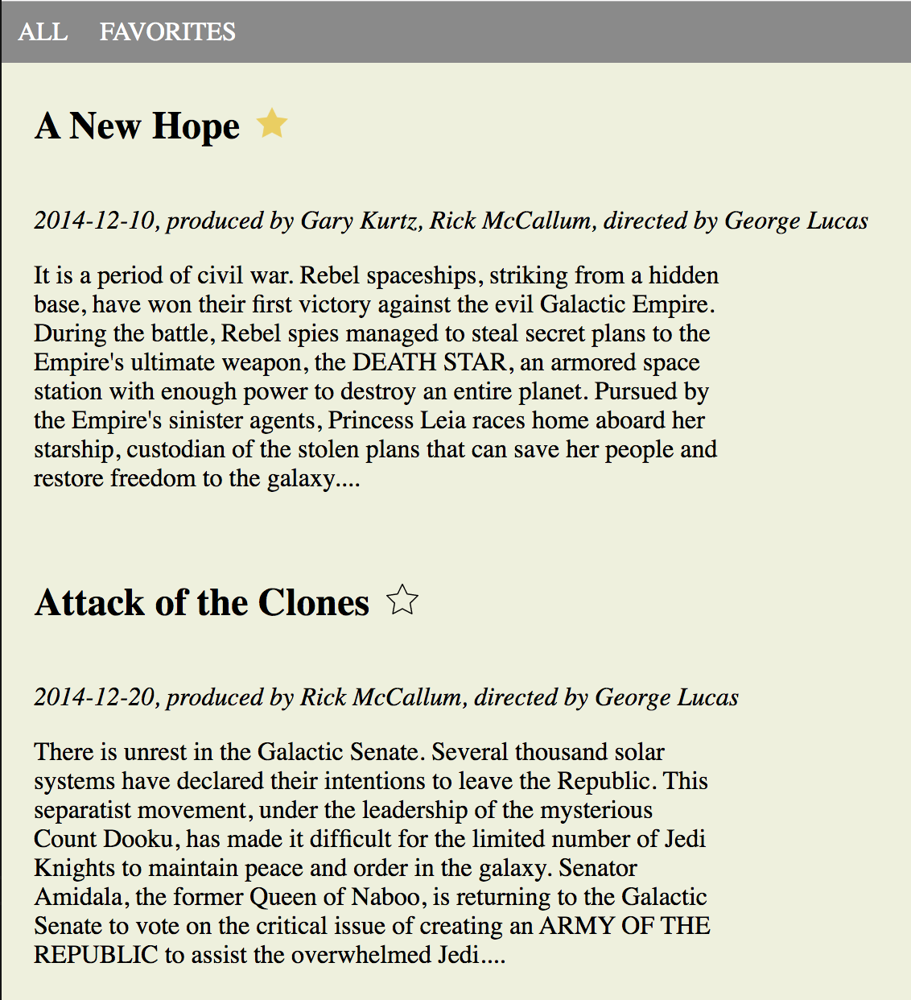

# Favorite Film

A vanilla Javascript web client application to present data from [swapi.co](https://swapi.co) and allows user to select favorite films.

The application displays a list of movies and allows to mark and unmark each movie as favorite. Selected favorites are saved on local storage.

## Run Locally

1. Download or clone this repository
2. Enable cookies in your browser (used for local storage)
3. Open `index.html` in the browser

## Code

`js/api/` - contains code related to Swapi API

`js/storage/` - contains code related to local storage

`js/view/` - contains code related to rendering view
